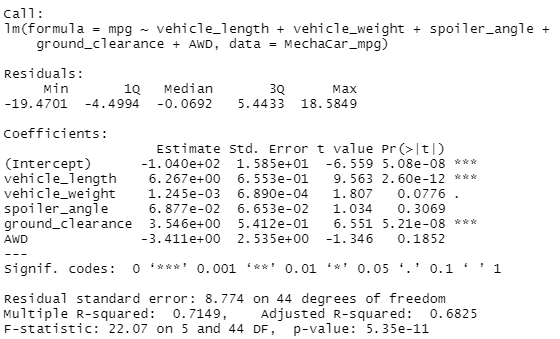
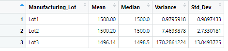
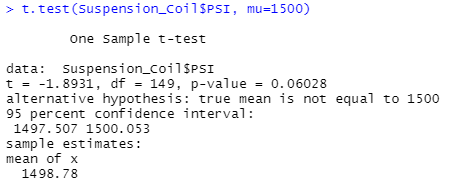
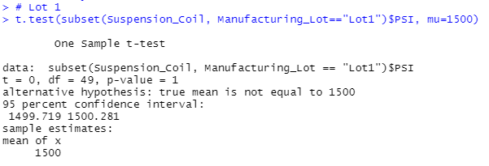
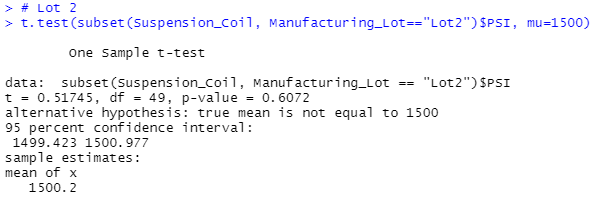
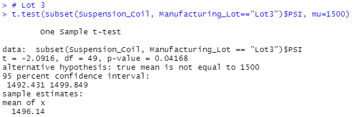

# MechaCar_Statistical_Analysis

## Background

A few weeks after starting his new role, Jeremy is approached by upper management about a special project. AutosRUs’ newest prototype, the MechaCar, is suffering from production troubles that are blocking the manufacturing team’s progress. AutosRUs’ upper management has called on Jeremy and the data analytics team to review the production data for insights that may help the manufacturing team.

## Linear Regression to Predict MPG

* Deliverable 1: Perform multiple linear regression analysis to identify which variables in the dataset predict the mpg of MechaCar prototypes

    

    - Q1. Which variables/coefficients provided a non-random amount of variance to the mpg values in the dataset?

    - Methodology: Each Pr(>|t|) value represents the probability that each coefficient contributes a random amount of variance to the linear model.

    - A1. The MechCar_mpg dataset, vehicle_length, ground_clearance and intercept are statistically unlikely to introduce random amounts of variance to the lineup. Therefore, the vehicle_length and ground_clearance have a significant impact on MPG.

    - Q2. Is the slope of the linear model considered to be zero? Why or why not?

    - Methodolgy: Examine the Pr(>|t|) value in the summary aboce for the (Intercept).

    - A2. The intercept is statistically significant at less than 0.05 and not zero. This would indicate that the intercept term explains an amount of variability in the dependent variable when all independent variables are equal to zero. This could mean that other features such as vehicle_weight and ground_clearance may need to be changed to help improve the predictive power. Also, other features may have been left out that need to be included.

    - Q3. Does this linear model predict mpg of MechaCar prototypes effectively? Why or why not?

    - Methodology: Examine the Multiple R-squared value to indicate how well the regression model approximates real-world data points.

    - A3. The Multiple R-squared value is 0.71 while the p-value remained very small. This indicates the model does an adequate job of predicting MPG.

## Summary Statistics on Suspension Coils

* Deliverable 2: Collect summary statistics on the pounds per square inch (PSI) of the suspension coils from the manufacturing lots

    

    

    - Q1. The design specifications for the MechaCar suspension coils dictate that the variance of the suspension coils must not exceed 100 pounds per square inch. Does the current manufacturing data meet this design specification for all manufacturing lots in total and each lot individually? Why or why not?

    - Methodolgy: Examine the mean, median, and variance in total (total_summary) and for each lot (lot_summary) to determine if the variance is within the 100 PSI.

    - A1. In total the specifications are met with a variance of 62.39.

    - A2. Lots 1 and 2 are within specification, but Lot 3 exceeds specifications, more than 100 PSI.

## T-Tests on Suspension Coils

* Deliverable 3: Run t-tests to determine if the manufacturing lots are statistically different from the mean population.

    - Q1. Are all lots, as well as each lot independently, statistically different from the population which has a mean of 1500 PSI.

    - Methodology of all lots: Perform a t.test using PSI to evaluate the p-value.

    

    - All lots are not statistically different from the population mean having a p-value of 0.060

    - Methodology by individual lots: Perform a t.test using subsets to evaluate the p-value.

    

    - Lot 1 is not statistically different from the population mean having a p-value of 1.

    

    - Lot 2 is not statistically different from the population mean having a p-value of 0.61

    

    - Lot 3 is statistically different from the population mean having a p-value of 0.042

* Deliverable 4: Design a statistical study to compare vehicle performance of the MechaCar vehicles against vehicles from other manufacturers. For each statistical analysis, you’ll write a summary interpretation of the findings.